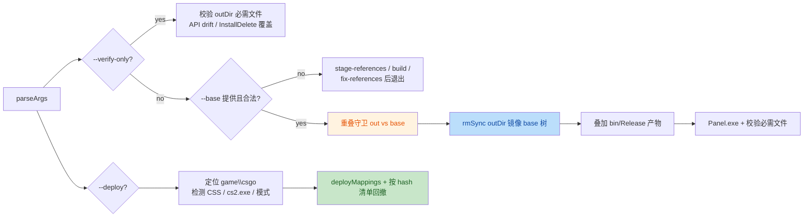

**意图**：一个构建/打包/部署三合一工具——从官方发行树（`--base`）镜像出 payload，叠加本地重建的 DLL，并从 `setup.iss` 反读必需文件清单和 `[InstallDelete]` 作为 CI 校验闸门；`--deploy` 路径复用同一套映射，把重建程序集推到实机游戏目录并用自维护的 hash 清单做回撤。整体设计有明确的防御意识（重叠守卫、dry-run、游戏运行检测），以下 3 个问题经双子代理独立验证均确认存在（2/2 一致）。

📊 **关键流程概览**

